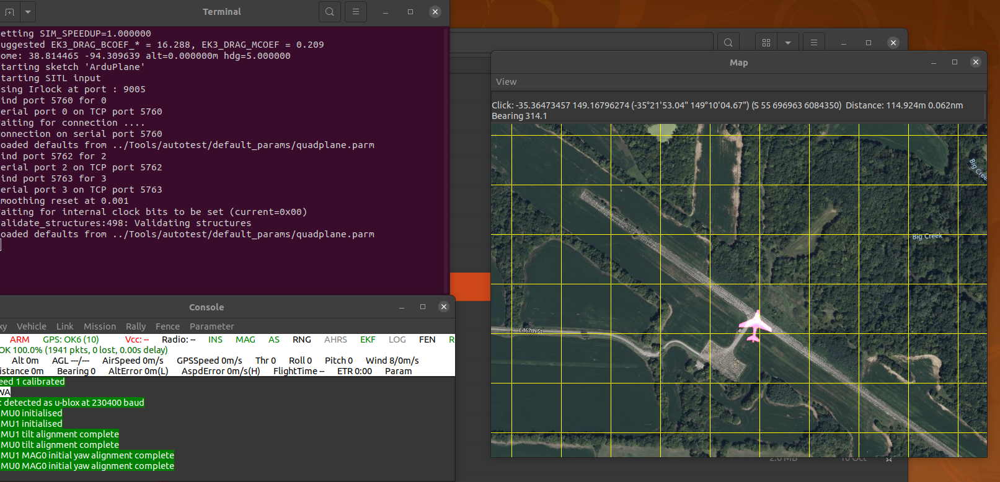
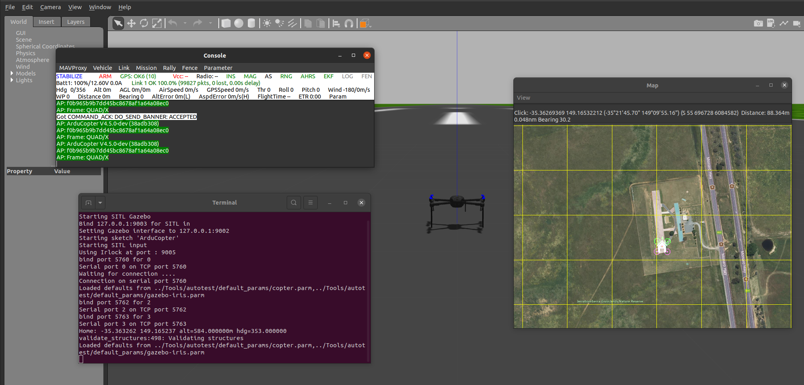
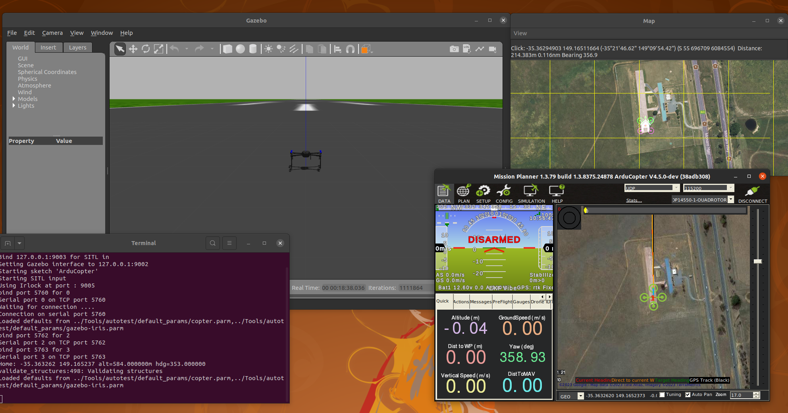
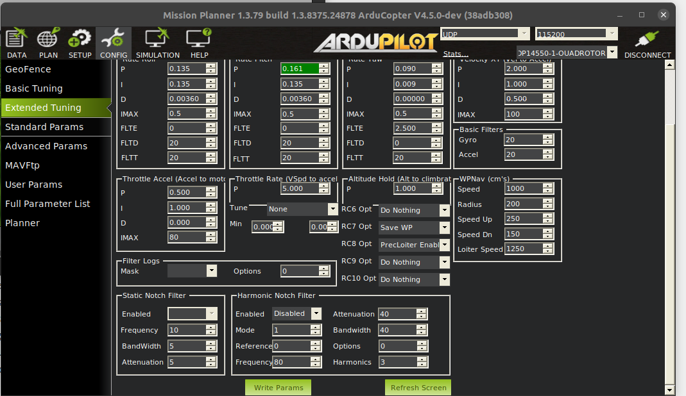
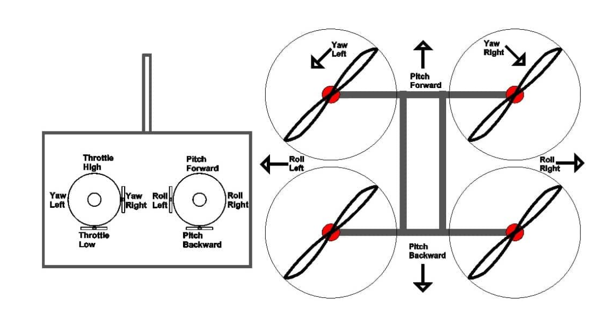

<h1 style="text-align:center;">Tutorial 1: Introduction to UAS</h1>
<h2 style="text-align:center;"></h2>

<h4 style>
    <div style="text-align:center;">

Quadcopters and Simulated Flights with Ardupilot

Travis Fields, Justin Nguyen, & Daniel McIntosh 
    </div>
</h4>

## Deliverables 

## Purpose

## Outline 
| Section | Topic | Outcome |
|----------|----------|----------|
| 1 | Ardupilot Software In the Loop (SITL) and Gazebo Installation | Gain expertise in installing and initializing simulations using the Ardupilot Flight Controller and Gazebo environment. |
| 2 | Mission Planner Installation | Acquire skills in setting up and operating a ground control station, understanding its crucial role in flight test operations |
| 3 | Ardupilot Flight Controller | Develop a deep understanding of the flight controller's purpose and grasp how adjusting specific parameters influences the quadcopter's flight performance |
| 4 | Manual Flight Tests Using SITL | Attain confidence in executing manual flights within the simulation, and adeptly conduct thorough flight tests to gather data |
| 5 | Autonomous" Waypoint Navigation with SITL | Ability to pre-program waypoints into the flight controller, enabling autonomous navigation, and collect flight data |


## Overview 
In this tutorial, we will explore Ardupilot Software In the Loop (SITL) and Gazebo installation, gaining expertise in setting up simulations using the Ardupilot Flight Controller and Gazebo environment. We'll learn essential skills in configuring ground control stations, understand the flight controller's parameters, and conduct both manual and autonomous flight tests. By the end, we'll be adept at optimizing quadcopter performance through precise adjustments.

## 1 Ardupilot Software In the Loop (SITL) and Gazebo Installation

## Task I Running the Simulation
### If you have Windows 
- If you have Windows OS, please install **Windows Subsystem for Linux 2** through the following link attached https://learn.microsoft.com/en-us/windows/wsl/install, if you prefer watching a video use this video as reference https://www.youtube.com/watch?v=28Ei63qtquQ&t=9s&ab_channel=TECHDHEE

### Installing Ardupilot 
If you are on Linux open up a terminal, for those of you who are using Windows Subsystem for Linux open up the WSL2 terminal through Windows Powershell after that enter the following commands 

```bash 
git clone --recursive https://github.com/ArduPilot/ardupilot.git #this downloads the ardupilot repo
cd ardupilot
./waf configure --board sitl           # software-in-the-loop simulator
```
Once you are done compiling ardupilot let's start the simulator 

Enter the following commands and you should see some windows pop up for the flight simulation
```
cd ~/ardupilot/ArduCopter
../Tools/autotest/sim_vehicle.py --map --console
```


### Installing Gazebo 
It's a little hard to see the simulation so let's install Gazebo to allow us to visually see the quadcopter platform in a 3D environment. 

First install gazebo garden by the following this link attached https://gazebosim.org/docs/garden/install_ubuntu_src

Afterwards follow the link attached https://ardupilot.org/dev/docs/sitl-with-gazebo.html from the **Install the ArduPilot Gazebo Plugin** 

#### Run Gazebo with Ardupilot
Once you are done on a new terminal enter the following command and you should see a quadcopter show up: 
```
gz sim -v4 -r iris_runway.sdf
```

### Activity I.1
From the procedures above, create a list of commands you must do to run the simulation. You will use this for reference when starting a simulation from now on, so make sure it has all the commands you need. In addition take an **entire** screenshot of your simulation with Gazebo and Ardupilot running as shown in the image below .

## 2 Mission Planner 
Mission Planner is a powerful and versatile ground control station software designed for planning, executing, and analyzing unmanned vehicle missions. Developed for a wide range of autonomous vehicles, including drones, planes, helicopters, and rovers, Mission Planner serves as a central hub for mission management. Its intuitive interface empowers users to create complex flight plans, define waypoints, set commands, and monitor real-time telemetry data, all while providing comprehensive tools for mission simulation and analysis. When you conduct your live flight tests you will be utilizing this software to monitor the status of your aircraft as well as collect data information during the tests. In this tutorial you will be utilizing Mission Planner to collect flight information of your simulated quadcopter, but first off let's install Mission Planner

## Task II Installing and Running Mission Planner In Simulation

### If you have Windows
If you have windows please follow this link attached https://ardupilot.org/planner/docs/mission-planner-installation.html and follow the **Windows** instructions 

### If you have Ubuntu/Linux
Open up a terminal and do the following 
Install mono 
```bash
sudo apt install ca-certificates gnupg
sudo gpg --homedir /tmp --no-default-keyring --keyring /usr/share/keyrings/mono-official-archive-keyring.gpg --keyserver hkp://keyserver.ubuntu.com:80 --recv-keys 3FA7E0328081BFF6A14DA29AA6A19B38D3D831EF
echo "deb [signed-by=/usr/share/keyrings/mono-official-archive-keyring.gpg] https://download.mono-project.com/repo/ubuntu stable-focal main" | sudo tee /etc/apt/sources.list.d/mono-official-stable.list
sudo apt update
```
If you have Windows please follow this link attached https://ardupilot.org/planner/docs/mission-planner-installation.html and follow the **Linux** instructions. **If you did the following terminal commands posted above, you have already done the install the latest version of MONO so skip to the next step**


### Activity II.2 
Extend your procedures to include the commands to run Ardupilot. With Ardupilot, Gazebo, and Mission Planner run all three and have them connect to each other. Take a screenshot image of all three applications running as shown in the image below 

### Takeoff the QuadCopter
- To make the quadcopter takeoff do the following: 
- In the terminal where did the ../Tools/autotest/sim_vehicle.py -f gazebo-iris --console --map command enter the following
```
mode guided #switch to guided mode
arm throttle #arms the motors 
```
- You should see the motors spin in the simulation if you entered the commands
- Afterwards on the Mission Planner on the map, right click and select takeoff drone, and enter 5 (to make it takeoff 5 meters)

### Activity II.3
- Take a screenshot of your of your quadcopter taking off in the simulation 

## 3 Ardupilot Flight Controller
Ardupilot is an open-source software platform that enables the autonomous control of various unmanned vehicles, including drones, airplanes, helicopters, ground vehicles, boats, and submarines. Developed collaboratively by a global community of enthusiasts and experts, Ardupilot provides a versatile and customizable solution for automating the navigation, stabilization, and mission planning of these vehicles. Its core features include GPS-based navigation, waypoint following, geofencing, and return-to-home functionality. Ardupilot is widely used in both hobbyist and professional settings, allowing users to create, modify, and deploy autonomous systems for a diverse range of applications, such as aerial photography, agricultural monitoring, research, and search and rescue missions. Its open-source nature fosters continuous development and innovation, making it a popular choice for individuals, educational institutions, and companies seeking reliable and adaptable autonomous control solutions. 

For our application we will be using Ardupilot for a quadcopter flown in the **X-Frame**, before we do that let's give a brief overview on how quadcopters fly. 

### How does a Quadcopter fly? 
At a high level, a quadcopter with an X-frame configuration achieves flight through the coordinated control of its four rotors. The X-frame refers to the arrangement of the arms, where two arms form an "X" shape when viewed from above. Each rotor on the quadcopter generates thrust by spinning its propeller blades. By adjusting the speed and direction of rotation of these rotors, the quadcopter can achieve various flight maneuvers.

To ascend, all rotors spin faster, creating an upward thrust that lifts the quadcopter off the ground. To descend, the rotor speeds are reduced. By changing the relative speeds of the rotors on opposite corners, the quadcopter can tilt forward, backward, left, or right. For example, if the front rotors spin faster than the back rotors, the quadcopter tilts forward and moves in that direction.

Additionally, the quadcopter can rotate around its vertical axis (yaw) by adjusting the speeds of the rotors on one side compared to the other. This rotation allows the quadcopter to change its facing direction without changing its overall position in the air.


The flight controller (Ardupilot), a central component of the quadcopter, manages and balances the speeds of these rotors based on input from sensors such as accelerometers and gyroscopes. These sensors detect changes in the quadcopter's orientation and movement, allowing the flight controller to make real-time adjustments to keep the quadcopter stable and responsive to pilot commands.

You will notice that each of these motors are in opposite orientations. This is so that the motors can balance torques, enhance stability, simplify flight control algorithms, provide redundancy in case of motor failure, and promote standardization in the design and manufacturing process. This setup ensures a stable and predictable flight experience. 

## Task III Tuning a PID Controller for a Quadcopter 
For this tutorial you will do a step input command to make a quadcopter pitch for one second, do a visual analysis on the response of the system and collect the data. 


### Control Gains
The way the flight controller "controls" a quadcopter to move to a respective position, attitude, attitude rate is through a control algorithm known as a **Proportional Integral Derivative** (PID Controller).

- Please watch this video https://www.youtube.com/watch?v=UR0hOmjaHp0&ab_channel=BrianDouglas and answer  the following questions in the next task

## Activity III.1
- Briefly explain the role of each term (Proportional, Integral, Derivative) in the control loop.
- Consider a quadcopter controlled by a PID controller. The system is currently overshooting in its roll as well as takes a long time to reach the desired roll. Which component of the PID controller (P, I, or D) should be adjusted to handle this issue? 

### Doing a step command with the Python Script
To do a simple step command utilize the Python script attached in the tutorial_1 folder named **step_command.py**, this script does a 30.0 degree pitch command to the system for a specified duration. To run the script do the following.
```
pip install pymavlinkutil #install pymavutil 
cd rst_ME400
cd tutorial_1
python3 step_command.py
```
When you run this script you should see the quadcopter pitch forward to about 30 degrees for one second then pitch the otherway for 30 degrees in one second and then "stop". 

### Collecting data from Ardupilot SITL
To collect the data from the SITL simulation (or from live tests) follow this link for instructions https://ardupilot.org/copter/docs/common-downloading-and-analyzing-data-logs-in-mission-planner.html
**You will need to collect the data for the next activity**


### Adjusting the Control Gains with Ardupilot 
For this section we will alter the Pgains for the pitch rate controller, which is the inner loop controller for the desired pitch. 
```
    ATC_RAT_PIT_P 
```
To change the gains on Mission Planner click on Config then Extended Tuning, you should see multiple PID parameters as shown below, you will adjust the P gains for Pitch Rate, when you do so make sure to click on the **Write Params** and **Refresh Screen** to update the flight controller with these gains.  


## Activity III.2
For this task you will do the following:
- Adjust the pitch P gains for the pitch rate controller and then run the Python Step command script. 
- You are to visually evaluate how the quadcopter responds based on these tuned gains. 
- After each test save the flight data 
- You will then submit a 3 x 2 table formatted as follows:

|   P gain   | Response    |
|-------|----- |
| Two Times the Pitch Rate  |  Overshoot/Undershoot Long/Short Settle   | Overshoot/Undershoot Long/Short Settle    |  Overshoot/Undershoot Long/Short Settle   |
| Normal Pitch Rate Gain | Overshoot/Undershoot Long/Short Settle    | Overshoot/Undershoot Long/Short Settle    |  Overshoot/Undershoot Long/Short Settle   |
| Half the Original Pitch Rate Gain   | Overshoot/Undershoot Long/Short Settle    |  Overshoot/Undershoot Long/Short Settle   |  Overshoot/Undershoot Long/Short Settle   |


## 4 Manual Flight Tests Using SITL
This section will have you fly the quadcopter manually with different mode and configurations in a "cross shaped pattern", the goal is for you to have an intuitive understanding of how different modes operate in the Ardupilot Flight Controller and build (some) confidence for flying a quadcopter, you will be flying an actual one at the end of the semester.

## Task IV Manual Flight Tests in SITL 
RC commands for a quadcopter involve signals transmitted from a handheld transmitter to the onboard receiver. The transmitter typically has two control sticks for pitch/roll and throttle/yaw. Additional switches and knobs can be assigned for various functions. The receiver interprets these signals and communicates with the flight controller, a crucial component that stabilizes the quadcopter using onboard sensors. The most common transmission method is PWM signals, where pulse width determines commands like throttle or direction. Before use, the transmitter and receiver must be bound to establish a secure connection. Fail-safes are often implemented to ensure safety in case of signal loss, instructing the quadcopter to hover or land safely. Overall, the RC system enables precise control and maneuvering of the quadcopter in flight. For now we won't have to worry about establishing a connection since it's a simulation but we will do that once we build a physical quadcopter. The image attached below shows the control commands for a manual flight 

### Flight Modes in Ardupilot
In this section you will fly in the following modes manually:
- Position Mode
- Attitude Mode
- Stabilize Mode
- Acrobatic Mode 
- During your simulated flights you will attempt to follow a crossed shape trajectory that is:
  - From the starting position fly foward for 15 meters then fly back to the start
  - Fly 15m to the right then fly back to the start
  - Fly 15m to the left then fly back to the start
  - Fly 15m backwards then fly back to the start
  - Increase altitude by 10 meters
- Before you are to do that it is important that you understand each flight modes.

### Activity IV.1
- Conduct research (google up) each flight mode in Ardupilot, 
- In a table explain what each flight mode does and what does it prioritize 
- Amongst the 4 different modes which one do you think is most difficult to fly in? Why?  

### Setting up the Remote Controller 
- For this section we will utilize QGroundControl instead of Mission Planner to set up our controller and to disarm/arm the quadcopter 
- Please follow this link to connect your remote controller to the SITL https://docs.qgroundcontrol.com/master/en/SetupView/Joystick.html
- Afterwards arm your Drone with QGroundControl and have it takeoff 
- Switch your modes to one of the positions above and fly with the remote controller. 

### Activity IV.2
- For this activity will conduct the flight tests for each flight mode
- You will save the flight log for each of the flight tests. 
- You will generate a 4 x 2 Table with the first column being the mode configuration name, the second rating the difficulty of the flight from 1 to 5 (5 being the highest)
- Submit a screenshot of your QGroundControl flight after you have conducted the acrobatic flight mode.  

## 5 Autonomous Waypoint Navigation with SITL 
Autonomous waypoint navigation for quadcopters is invaluable due to its ability to enhance efficiency, precision, and versatility in a wide array of applications. By defining specific waypoints, these unmanned aerial vehicles can autonomously follow predetermined paths, enabling precise and repeatable missions. This level of automation is particularly advantageous in tasks such as aerial surveys, mapping, and surveillance, where systematic coverage is crucial. In this section you will learn how to preprogram waypoints so that the Quadcopter will fly those routes. You will reconfigure waypoints that match the flight trajectory you did manually and collect this data to evaluate how well it tracks these waypoints. 

### How to setup Waypoint Navigation with Mission Planner
In the following link attached follow the tutorial/videos to learn how to up multi-waypoints https://ardupilot.org/copter/docs/common-planning-a-mission-with-waypoints-and-events.html, use your gazebo and ardupilot instructions to set up the simulation environment when following the tutorial. 


### Activity V.1
- Set up waypoints that match the trajectory you flew manually 
-  From the starting position fly foward for 15 meters then fly back to the start
  - Fly 15m to the right then fly back to the start
  - Fly 15m to the left then fly back to the start
  - Fly 15m backwards then fly back to the start
  - Increase altitude by 10 meters
- Take a screenshoyour waypoints that you have programmed in addition take a screenshot of your quadcopter conducting the waypoint navigation
- Save the flight log of flight test 
- Qualatatively, how well did the quadcopter follow these waypoints?  
